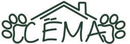

# 🐾 Зоогостиница и кинологический центр «Сёма Отель»

> Современный адаптивный лендинг для загородного отеля передержки животных и центра дрессировки в Раменском районе Московской области.

[](https://semahotel.ru)
[](https://semahotel.ru)
[](https://github.com/Divavi95/Sema-hotel/actions)

<p align="center">
  
</p>

---

## 📖 О проекте

**«Сёма Отель»** — проект семейной зоогостиницы, расположенной в экологически чистом районе Подмосковья (с. Заворово для собак и с. Макаровка для кошек). 

Сайт разработан «под ключ»: от создания дизайн-системы и UX-прототипирования до кроссбраузерной вёрстки, интерактивной логики, базовой поисковой оптимизации (SEO) и настройки автоматического пайплайна непрерывного развёртывания (CI/CD).

### 🌟 Ключевые возможности и разделы

- **Hero-экран с быстрым выбором питомца**: удобное переключение фокуса на собак или кошек с якорным переходом к целевым номерам.
- **Интерактивный каталог номеров (Номера и Цены)**:
  - Табы переключения «Собаки» / «Кошки».
  - Кастомные галереи-слайдеры с эффектом матового стекла (*Frosted Glass*) для кнопок навигации.
  - Детальные карточки с удобными списками включённых услуг и условиями проживания.
- **Кинологический центр и дрессировка**:
  - Тарифы воспитания: бытовое послушание, щенячий курс, курс ОКД, коррекция поведения.
  - Прозрачные цены за разовые тренировки и блоки занятий.
- **Услуги фотографа анималиста**:
  - Табы форматов съёмки (Индивидуальная, Хозяин + Хвостик, Экспресс).
  - Интерактивные галереи реальных фоторабот с плавной прокруткой и индикаторами.
- **Интерактивный FAQ (Вопрос-Ответ)**:
  - Раскрывающийся аккордеон с анимацией высоты на чистом CSS/JS.
- **Отзывы реальных гостей**:
  - Горизонтальная карусель отзывов из разных источников (Telegram, WhatsApp, 2ГИС, Яндекс Карты).
  - Слайдер пушистых постояльцев («Наши гости»).
  - Форма отправки отзыва с интерактивным звёздным рейтингом и уведомлением.
- **Контакты и карточки кураторов**:
  - Карточки кинолога Людмилы и фотографа Виктории.
  - Адаптивный мобильный аккордеон с кнопками быстрого вызова в один клик.
  - Прямые ссылки на мессенджеры (Telegram, MAX).
  - Форма онлайн-заявки на бронирование.

---

## 🎨 Дизайн и UI/UX решения

- **Природная гармоничная палитра**:
  - Deep Forest Green (`#1E2A21` / `#2D4436`) — символ спокойствия, природы и доверия.
  - Terracotta (`#CF6B4C`) — акцентный цвет для кнопок действий (CTA) и важных меток.
  - Warm Sage & Mint (`#EBF1ED` / `#DCE5DF`) — мягкие пастельные плашки и фоны.
- **Mobile-First адаптивность**:
  - Полная поддержка всех устройств: смартфоны (от 360px), планшеты и 4K-мониторы.
  - Мобильное всплывающее меню с фиксацией скролла.
  - Свайп и адаптивные элементы управления, оптимизированные под тач-интерфейсы.
- **Микроанимации и визуальный отклик**:
  - Полупрозрачные навигационные стрелки `backdrop-filter: blur(8px)`.
  - Эффект нажатия и плавного наведения на кнопки.
  - Защита от автозума в Safari iOS на полях ввода.

---

## 🛠 Технологический стек

| Направление | Стек технологий |
|---|---|
| **Frontend** | HTML5, CSS3 (Modern Flexbox, CSS Grid, Custom Properties, Media Queries), Vanilla JavaScript (ES6+) |
| **Шрифты и Иконки** | Google Fonts ([Manrope](https://fonts.google.com/specimen/Manrope)), Inline SVG |
| **SEO & Аналитика** | Микроразметка Schema.org (`LocalBusiness`), Open Graph, `sitemap.xml`, `robots.txt`, Яндекс Вебмастер |
| **DevOps / CI/CD** | GitHub Actions, FTP/SFTP автоматический деплой на сервер хостинга Reg.ru |

---

## 🚀 Архитектура и структура проекта

```text
├── .github/
│   └── workflows/
│       └── deploy.yml        # CI/CD пайплайн автодеплоя на Reg.ru
├── css/
│   └── styles.css           # Модульная таблица стилей, адаптив и анимации
├── images/                  # Оптимизированные графические ассеты и фото питомцев
├── index.html               # Главная страница лендинга с микроразметкой
├── robots.txt               # Инструкции для поисковых краулеров
├── sitemap.xml              # Карта сайта для поисковиков (Google, Яндекс)
├── favicon.ico              # Фавиконка для браузеров (16x16, 32x32, Apple Touch)
└── README.md                # Документация проекта
```

---

## ⚙️ Локальный запуск

Для просмотра проекта достаточно открыть `index.html` в любом современном браузере или запустить локальный статический сервер:

```bash
# Клонирование репозитория
git clone https://github.com/Divavi95/Sema-hotel.git

# Переход в директорию
cd Sema-hotel

# Запуск через Python (любой порт, например 8000)
python -m http.server 8000

# Либо через Node.js npx
npx serve .
```

После этого откройте в браузере `http://localhost:8000`.

---

## 👩‍💻 Автор и разработчик

- **Дизайн & Frontend-разработка**: [Divavi95](https://github.com/Divavi95)
- **Проект**: [Зоогостиница «Сёма Отель»](https://semahotel.ru)

---

<p align="center">Сделано с любовью и заботой о питомцах 🐶🐱</p>
